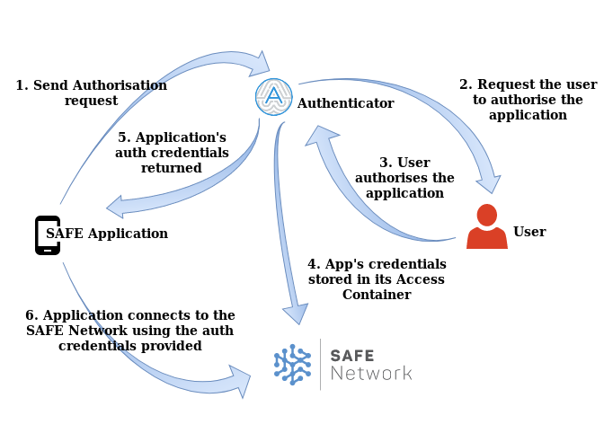
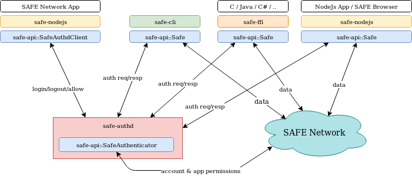

# The Safe API

| [MaidSafe website](https://maidsafe.net) | [Safe Dev Forum](https://forum.safedev.org) | [Safe Network Forum](https://safenetforum.org) |
|:----------------------------------------:|:-------------------------------------------:|:----------------------------------------------:|

## Table of contents

- [The Safe API](#the-safe-api)
  - [Table of contents](#table-of-contents)
  - [Description](#description)
  - [The Safe API (sn_api)](#the-safe-api-sn_api)
  - [The FFI layer (safe-ffi)](#the-ffi-layer-safe-ffi)
  - [The Safe Network CLI](#the-safe-network-cli)
  - [The Authenticator daemon](#the-authenticator-daemon)
  - [JSON-RPC and QUIC](#json-rpc-and-quic)
  - [Further Help](#further-help)
  - [License](#license)
  - [Contributing](#contributing)

## Description

In this repository you'll find all that's needed by any application which intends to connect and read/write data on [The Safe Network](https://safenetwork.tech).

A Rust Safe application can make use of the `sn_api` crate to be able to not only read/write data on the Safe Network but also to send/receive authorisation requests to the Safe Authenticator (see https://hub.safedev.org/discover for additional info of the Authenticator).

In addition to the `sn_api` crate to be used by Rust applications, this repository contains the [safe-ffi](safe-ffi) library and a couple of applications ([sn_authd](sn_authd) and [sn_cli](sn_cli)) which are required depending on the type of Safe application you are developing, use case, and/or if you are just a user of the Safe Network willing to interact with it using a simple command line interface.

The following diagram depicts how each of the artifacts of this repository fit in the Safe applications ecosystem. You can find more information about each of them further below in the next section of this document.

## The Safe API ([sn_api](sn_api))

The [sn_api](sn_api) is a Rust crate which exposes the Safe API with all the functions needed to communicate with the Safe Network and the Safe Authenticator. If you are developing a Rust application for Safe, this is all you need as a dependency from your app.

## The FFI layer ([safe-ffi](safe-ffi))

The [safe-ffi](safe-ffi) is a Rust crate exposing the same functions as the Safe API (`sn_api`) but in the form of an interface which can be consumed from other programming languages like C, this is achieved by the use of the [Rust FFI feature](https://doc.rust-lang.org/book/ch19-01-unsafe-rust.html#using-extern-functions-to-call-external-code).

Therefore, if you are developing a Safe application using a different programming language than Rust, this is the crate you need to access the Safe API. This crate also provides scripts to automatically generate the binding libraries for some languages like Java and C#.

## The Safe Network CLI

The [sn_cli](sn_cli) is a Rust application which implements a CLI (Command Line Interface) for the Safe Network.

The Safe CLI provides all the tools necessary to interact with the Safe Network, including storing and browsing data of any kind, following links that are contained in the data and using their addresses on the network, using safecoin wallets, and much more. Using the CLI users have access to any type of operation that can be made on the Safe Network and the data stored on it.

If you are just a Safe user, or a system engineer creating automated scripts, this application provides you with all you need to interact with the Safe Network. Please refer to [The Safe CLI User Guide](sn_cli/README.md) to learn how to start using it.

## The Authenticator daemon

The [sn_authd](sn_authd) is a Safe Authenticator implementation which runs in the background a daemon on Linux and Mac, or as a service in Windows platforms.

The Safe Authenticator gives complete control over the type of access and permissions that are granted to the applications used by the Safe users. Any application that is intending to write data on the Network on behalf of the user needs to get credentials which are authorised by the user, and the Safe Authenticator is the component which facilitates such mechanism.

This application is normally shipped as part of the package of an Authenticator GUI, like the [Safe Network Application](), and therefore Safe users and Safe app developers don't need it or worry about since the Safe API already provides functions to interact with the `sn_authd`, and the Safe CLI also has commands to do so.

## JSON-RPC and QUIC

One last crate found in this repository is the [jsonrpc-quic](jsonrpc-quic). This crate provides the implementation of [JSON-RPC](https://www.jsonrpc.org/) over [QUIC](https://en.wikipedia.org/wiki/QUIC), which is required by the Authenticator daemon communication protocol.

This crate exposes a minimised set of functions which are used by other crates to implement the Authenticator daemon communication protocol. On one hand the `sn_api` makes use of it to be able to send JSON-RPC messages to the `authd` over QUIC, and on the other hand the `sn_authd` makes use of it to accept those requests from clients, generating and sending back a JSON-RPC response over QUIC. Please refer to the [sn_authd README](sn_authd/README.md) to see some examples of these type of requests/responses.

## Further Help

You can discuss development-related questions on the [Safe Dev Forum](https://forum.safedev.org/).
If you are just starting to develop an application for the Safe Network, it's very advisable to visit the [Safe Network Dev Hub](https://hub.safedev.org) where you will find a lot of relevant information.

## License

This Safe Network library is dual-licensed under the Modified BSD ([LICENSE-BSD](LICENSE-BSD) https://opensource.org/licenses/BSD-3-Clause) or the MIT license ([LICENSE-MIT](LICENSE-MIT) https://opensource.org/licenses/MIT) at your option.

## Contributing

Want to contribute? Great :tada:

There are many ways to give back to the project, whether it be writing new code, fixing bugs, or just reporting errors. All forms of contributions are encouraged!

For instructions on how to contribute, see our [Guide to contributing](https://github.com/maidsafe/QA/blob/master/CONTRIBUTING.md).
