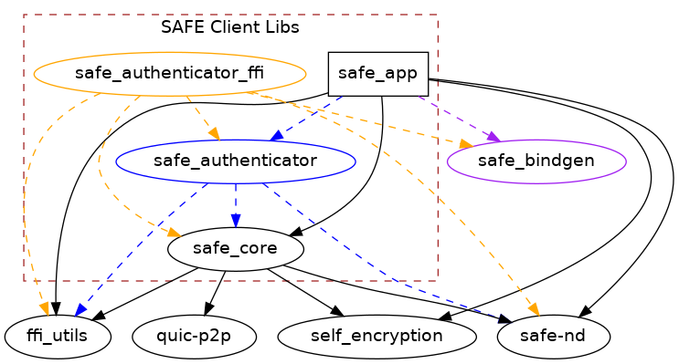

# safe_client_libs

|Linux/macOS|Windows|Issues|Lines of Code|
|:--------:|:-----:|:----:|:-----:|
|[](https://travis-ci.com/maidsafe/safe_client_libs)|[](https://ci.appveyor.com/project/MaidSafe-QA/safe-client-libs/branch/master)|[](https://waffle.io/maidsafe/safe_client_libs)|[](https://github.com/maidsafe/safe_client_libs)

| [MaidSafe website](https://maidsafe.net) | [SAFE Dev Forum](https://forum.safedev.org) | [SAFE Network Forum](https://safenetforum.org) |
|:-------:|:-------:|:-------:|

## About

**SAFE Client Libs** is a set of libraries providing a way for developers to consume and use the SAFE Network facilities. The libraries communicate with [Vaults](https://github.com/maidsafe/safe_vault) and build upon the foundation of fundamental network components, such as [Crust](https://github.com/maidsafe/crust) and [Routing](https://github.com/maidsafe/routing), to provide higher-level network abstractions like files and directories.

Please see [Introduction to Client Libs](https://github.com/maidsafe/safe_client_libs/wiki/Introduction-to-Client-Libs) for more about the project.

This is the project workspace. Please refer to individual members for details:

- [safe_core](safe_core/README.md)
- [safe_authenticator](safe_authenticator/README.md)
- [safe_app](safe_app/README.md)

Crate graph ([explanation](https://github.com/maidsafe/safe_client_libs/wiki#crate-graph)):



## Building from source

### Installing Rust

The Rust compiler is required in order to build Client Libs. Please follow the official [Rust installation instructions](https://www.rust-lang.org/en-US/install.html).

The latest **Stable** version of Rust is required.

If you already have Rust installed, you may need to upgrade to the latest stable:

```
rustup update stable
```

### Downloading Client Libs

The Client Libs repository can be downloaded either as a zip archive from the [official repository](https://github.com/maidsafe/safe_client_libs) or by using Git:

```
git clone https://github.com/maidsafe/safe_client_libs.git
```

### Building the libraries

To build one of the libraries, first navigate to its directory: this will be either `safe_core`, `safe_authenticator`, or `safe_app`.

To build the library in debug mode, simply use the command

```
cargo build --release
```

This builds the library in release mode, which is how we build our official binaries.

To run tests:

```
cargo test --release
```

**Note:** Make sure to always build in release mode (indicated by the `--release` flag). When testing, this will catch rare FFI bugs that may not manifest themselves in debug mode. Debug mode is also unoptimized and can take an inordinate amount of time to run tests or examples.

### More about building

For information about available features, see [Features](https://github.com/maidsafe/safe_client_libs/wiki/Building-Client-Libs#features).

For building using Docker, see [Docker](https://github.com/maidsafe/safe_client_libs/wiki/Building-Client-Libs#docker).

For configuration options, see [Configuring Client Libs](https://github.com/maidsafe/safe_client_libs/wiki/Configuring-Client-Libs).

## Contributing

Want to contribute? Great! There are many ways to give back to the project, whether it be writing new code, fixing bugs, or just reporting errors. All forms of contributions are encouraged!

For instructions on how to contribute, see [Guide to contributing](https://github.com/maidsafe/safe_client_libs/wiki/Guide-to-contributing).

For our testing practices, see [Testing Client Libs](https://github.com/maidsafe/safe_client_libs/wiki/Testing-Client-Libs).

## More about the project

Please see [the Client Libs wiki](https://github.com/maidsafe/safe_client_libs/wiki) for our comprehensive documentation.

## License

This SAFE Network Software is licensed under the General Public License (GPL), version 3 ([LICENSE](LICENSE) http://www.gnu.org/licenses/gpl-3.0.en.html).
